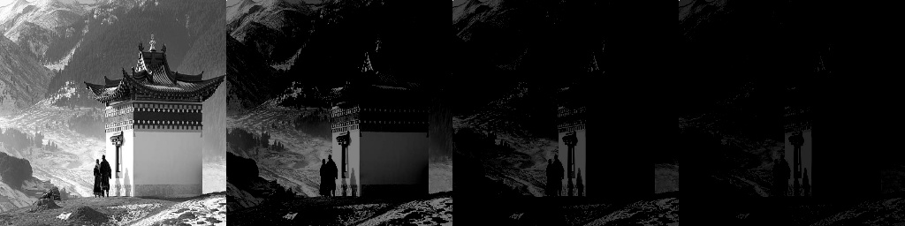
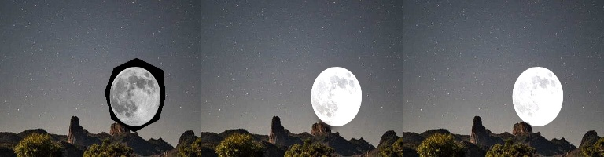

# Gradient Domain Fusion

repo used : [Gradient-Domain-Fusion](https://github.com/OlaPietka/Gradient-Domain-Fusion/tree/main)

Generated from image[0,0] pixel value and masking rest .

`image                               pix[0,0]/2                        pix[0,0]/4                         pix[0,0]/8`

`Background+masked_Foreground                Gradient                         Mix_Gradient`

